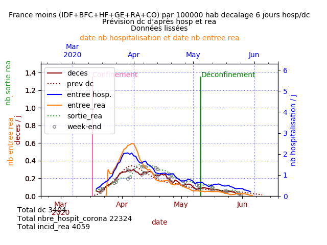
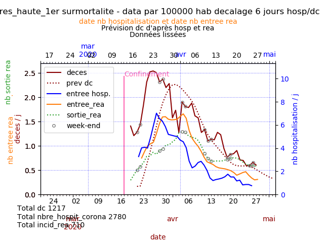
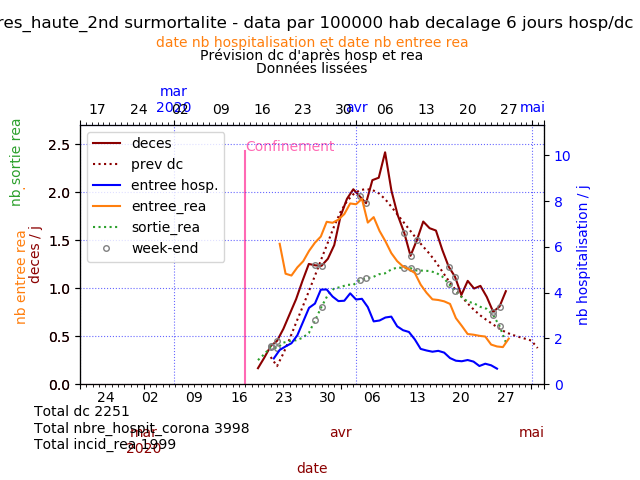
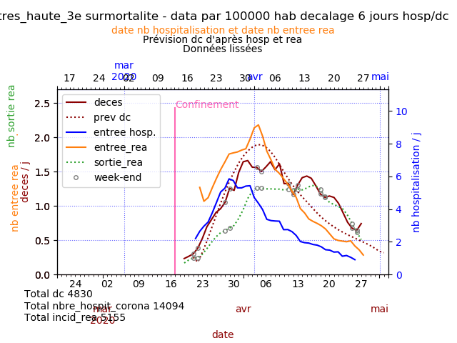
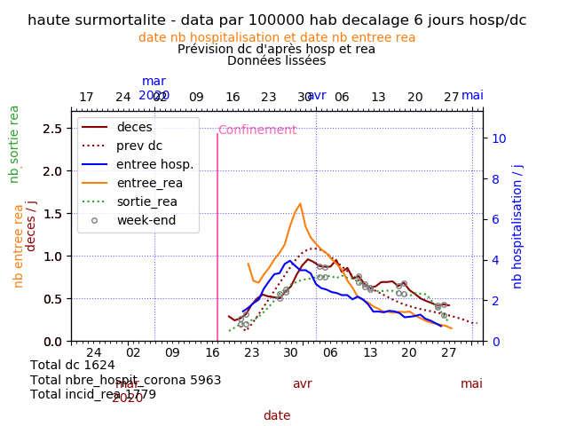
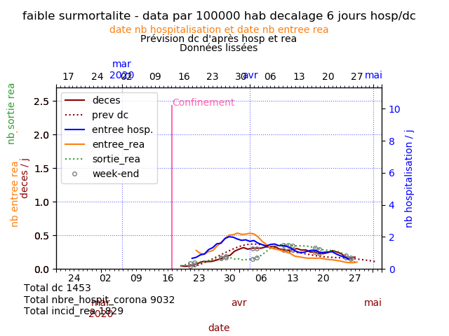
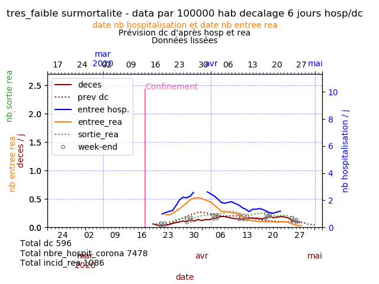
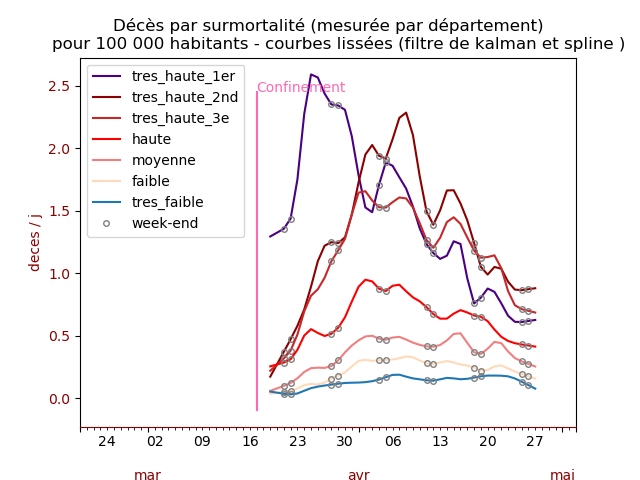

## Comparaison des hospitalisations après passage aux urgences et décès quelques jours plus tard pour COVID-19

### Données
Données provenant de data.gouv.fr :
https://www.data.gouv.fr/fr/datasets/donnees-des-urgences-hospitalieres-et-de-sos-medecins-relatives-a-lepidemie-de-covid-19/#discussion-5e81dd4a77c21352b6a2b6b5-1 
et https://www.data.gouv.fr/fr/datasets/donnees-hospitalieres-relatives-a-lepidemie-de-covid-19/

Données provenant de l'insee :
Surmortalité
https://www.insee.fr/fr/information/4470857#graphique-figure2_radio1
Nombre d'habitants par département
https://insee.fr/fr/statistiques/4277596?sommaire=4318291

Les données ont été **lissées**. 
Les valeurs sont donc légèrement différentes des valeurs issues des fichiers.
Certaines erreurs sont corrigées à la main, notamment lorsque les décès du jour sont négatifs.

### Information sur les entrées en réa

Les données d'hospitalisation après passage aux urgences et nombre d'entrée en réanimation sont décalées de quelques jours par rapport aux nombres quotidiens de décès pour mieux comparer les courbes.
Les régions en tension comprennent l'Ile de France, les Hauts de France, la Bourgogne Franche Comté, Auvergne Rhone Alpes, le Grand Est et la Corse.

Les entrées en réanimation présentent un pic autour du 1er avril, aussi bien pour les régions en tension que les autres, sachant que le confinement a commencé le 17 mars, soit 15 jours plus tôt.

Comme tous les patients ne rentrent pas en réanimation, le nombre de décès peut très bien être supérieur au nombre des personnes entrées en réanimation.

On notera que l'échelle des décès et des entrées en réanimation est à gauche et que l'échelle du nombre d'hospitalisation est à droite pour tenir compte qu'il y a environ quatre fois plus d'hospitalisations que de décès. Le rapport entre les échelles est constant sur tous les tracés. 

### Sortie de réanimation (IDF)

La PHP a étudié en interne le profil des patients hospitalisés (étude non publique, résultats disponibles dans un article des Echos).
Les patients restent longtemps en réanimation et si la durée moyenne du séjour est d'une semaine, plus de 50% restent plus de 10 jours en réanimation. Le taux de décès a été calculé à 30%.

On notera, notamment dans les régions en tension dont l'Ile de France, que le nombre de décès et le nombre de personnes admises en réa est très voisin. On peut en déduire que 30 % des décès hospitaliers ont lieu en réanimation et la majorité d'entre eux dans des services non réanimatoires. Les personnes en réanimation sont plus jeunes que les autres comme on le voit sur les camemberts de [l'Ile de France.](https://github.com/htonchia/covid-19-France/blob/master/Hauts-de-Seine_Seine_Saint_Denis.md#ages-des-personnes-admises-en-rea-en-ile-de-france)

[Article des echos](https://www.lesechos.fr/economie-france/social/un-passage-en-reanimation-tres-long-pour-les-malades-du-coronavirus-1197254)

### Résultat France
Sur la France entière, les courbes montrent actuellement une corrélation générale entre les hospitalisations après passage aux urgences pour suspicion de COVID-19 et les décès quotidiens quelques jours plus tard.

## Resultats régions en tension et autres régions par 100 000 habitants

### Régions en tension (données lissées)
Ile de France (IDF), Bourgogne Franche Comté (BFC), Hauts de France (HF), Grand Est (GE), Auvergne Rhône Alpes (RA), Corse (CO).

### Autres régions (données lissées)
La France moins les régions citées.

## Résultats par départements agrégés par surmortalité
La surmortalité provient de l'Insee.
Il s'agit de la surmortalité par département entre le 1er et le 30 mars 2020 par rapport à la même période de 2019 calculées par l'Insee pour les très hautes surmortalités 1 et 2.

La très haute surmortalité 3 n'est apparue que sur la période du 1er mars au 6 avril dans les calculs de l'Insee.
Pour les autres, haute à très faible, les départements ont été classés par la surmortalité calculée au 6 avril :

Les courbes suivantes permettent de suivre l'évolution des décès, des hospitalisations et des entrées en réanimation par le type de surmortalité des départements.
Quelque que soit la vigueur de la circulation de l'épidémie, les décès présentent un pic le 7 avril, trois semaines après le début du confinement.
La dernière courbe doublement lissée (Kalman + spline) présente toujours une ondulation avec des bas le week-end réputés provenir de retards d'enregistrement, notamment pour le long week-end de Paques (source directeur général de la santé).

**Toutes les courbes sont lissées, sans que cela n'efface complètement les effets week-end.**

### Très forte surmortalité 1ère vague (>40 %)
Il s'agit des premiers départements touchés, l'Oise, le Bas-Rhin et les Vosges.

### Très forte surmortalité 2e vague (>40 %)

### Très forte surmortalité au 6 avril (>40 %)
Il s'agit principalement du reste de l'Ile de France et de département du Grand Est non touché par la première vague.

### Forte surmortalité

### Surmortalité moyenne

### Surmortalité faible

### Evolution négative

### Comparaison des décès par départements groupés par surmortalite

