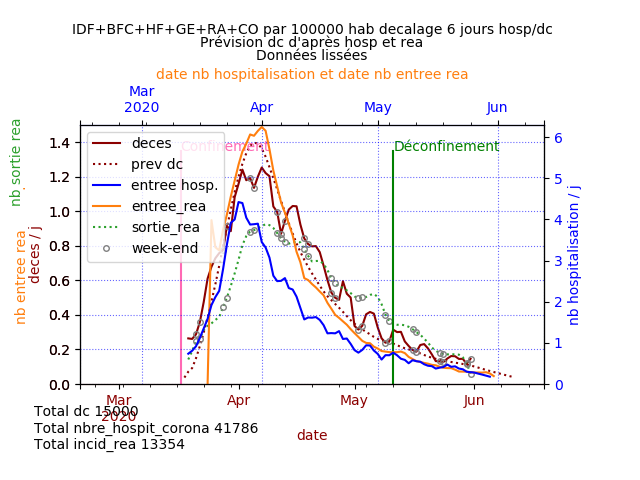
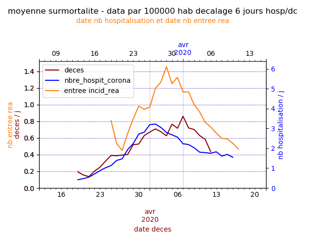

## Comparaison des hospitalisations après passage aux urgences et décès 6 jours plus tard pour COVID-19

### Données
Données provenant de data.gouv.fr :
https://www.data.gouv.fr/fr/datasets/donnees-des-urgences-hospitalieres-et-de-sos-medecins-relatives-a-lepidemie-de-covid-19/#discussion-5e81dd4a77c21352b6a2b6b5-1 
et https://www.data.gouv.fr/fr/datasets/donnees-hospitalieres-relatives-a-lepidemie-de-covid-19/

Données provenant de l'insee :
Surmortalité
https://www.insee.fr/fr/information/4470857#graphique-figure2_radio1
Nombre d'habitants par département
https://insee.fr/fr/statistiques/4277596?sommaire=4318291

Les données ont été **lissées** et notamment **le déficit de décès les dimanches** avec un rattrapage les lundis. 
Les valeurs sont donc légèrement différentes des valeurs issues des fichiers.

### Information sur les entrées en réa

Les données d'hospitalisation après passage aux urgences et nombre d'entrée en réanimation sont décalées de quelques jours par rapport aux nombres quotidiens de décès pour mieux comparer les courbes.
Les régions en tension comprennent l'Ile de France, les Hauts de France, la Bourgogne Franche Comté, Auvergne Rhone Alpes, le Grand Est et la Corse.

Les entrées en réanimation présentent un pic autour du 1er avril, aussi bien pour les régions en tension que les autres, sachant que le confinement a commencé le 17 mars, soit 15 jours plus tôt

### Résultat France
Sur la France entière, les courbes montrent actuellement une corrélation générale entre les hospitalisations après passage aux urgences pour suspicion de COVID-19 et les décès quotidiens 6 jours plus tard.
On notera que le nombre des hospitalisations est divisé par 4,2 pour une meilleure comparaison des courbes.

## Resultats régions en tension et autres régions par 100 000 habitants

### Régions en tension (données lissées)

### Autres régions (données lissées)

## Résultats par départements agrégé par surmortalité
La surmortalité provient de l'insee.
Les courbes suivantes permettent de suivre l'évolution des décès, des hospitalisations et des entrées en réanimation par le type de surmortalité des départements.
Quelque que soit la vigueur de la circulation de l'épidémie, les décès présentent un pic le 7 avril, trois semaines après le début du confinement.

### Très forte surmortalité (>40 %)

### Forte surmortalité

### Surmortalité moyenne

### Surmortalité faible

### Evolution négative

