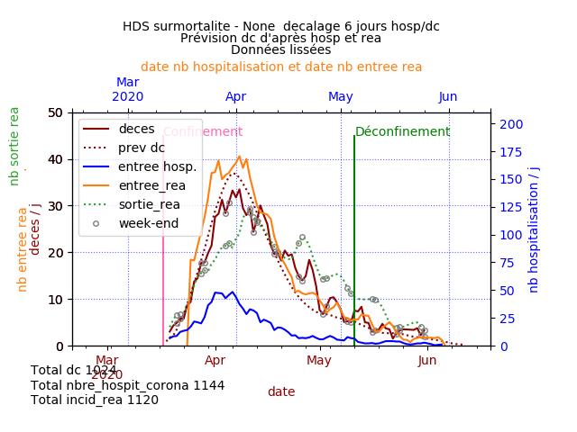
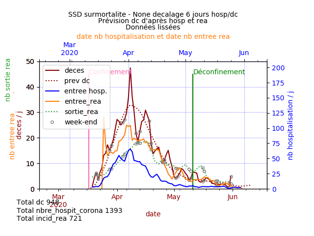
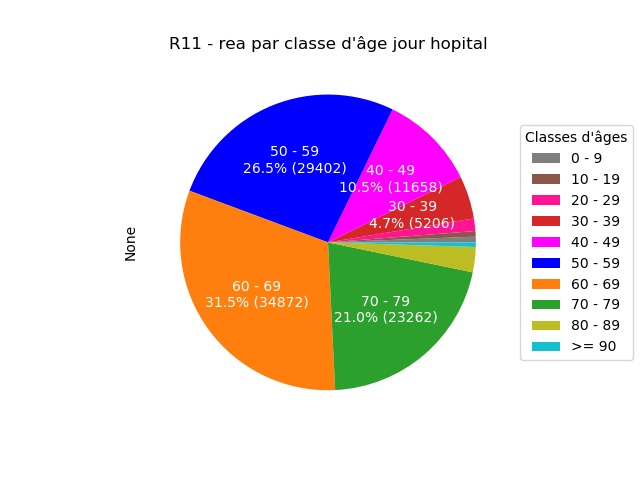

## Comparaison des données des Hauts-de-Seine et de la Seine-Saint-Denis

La surmortalité de ces deux départements a été exceptionnelle dès la fin mars d'après les données de l'Insee ( [voir les explications détaillées](https://github.com/htonchia/covid-19-France/blob/master/Comparaison.md#résultats-par-départements-agrégés-par-surmortalité)). Pour autant les données de ces deux départements présentent des différences notables.

### Les données

Elles proviennent de data.gouv.fr.
[Voir les explications détaillées](https://github.com/htonchia/covid-19-France/blob/master/Comparaison.md#données)

Il s'agit des décès hospitaliers, des hospitalisations après passage aux urgences et des entrées en réanimation.

Les données de décès et d'entrée en rea ont été filtrées avec un lisseur de Kalman, les données d'hospitalisations après passage aux urgences ont fait l'objet d'une moyenne mobile.

Les Hauts-de-Seine et la Seine-Saint-Denis ont un nombre d'habitants similaire voisin de 1,6 M d'après l'Insee.

### Les Hauts-de-Seine

### La Seine-Saint-Denis

### Comparaison
Avec un nombre d'habitants similaire et un nombre de décès à peine supérieur (680 vs 662 au 18 avril 2020) et un nombre d'hospitalisation après passage aux urgences un peu supérieur, la Seine-Saint-Denis présente un nombre de personnes admises en réanimation très inférieur (518 au 18 avril 2020) aux Hauts-de-Seine (883 au 18 avril 2020).

Sachant que les personnes plus âgées, au delà de 79 ans sont plus rarement réanimatoires, il aurait été intéressant de comparer les âges des personnes admises en réanimation, mais les chiffres disponibles sont disponibles uniquement par région.

D'après les données de l'Insee la Seine-Saint-Denis est plus jeune que les Hauts-de-Seine ce qui est contradictoire avec un nombre de personnes en réa plus faible en Seine-Saint-Denis. L'âge n'est pas le seul facteur de risque pris en compte pour accéder en réa. Normalement les lits de réanimation en Ile de France n'ont jamais refusé personne, mais est-ce que les critères ont été durcis pendant un temps ? 

#### Ages en Seine-Saint-Denis

#### Ages dans les Hauts-de-Seine

#### Ages des personnes admises en rea en Ile de France

#### Ages des personnes décédées à l'hôpital en Ile de France

On note une différence significative des âges des personnes admises en réanimation, bien plus jeunes que ceux des décès. 
