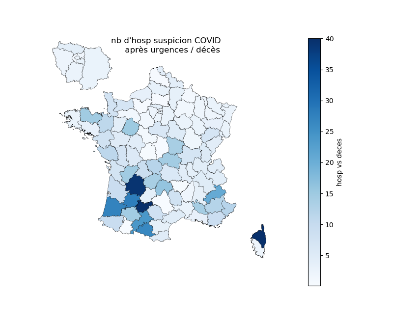
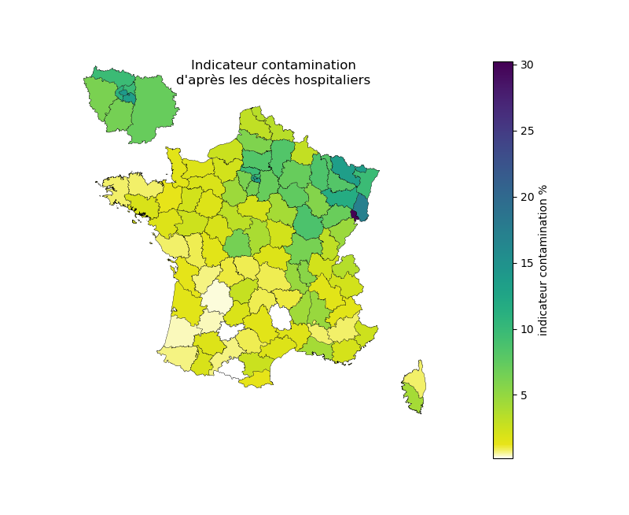
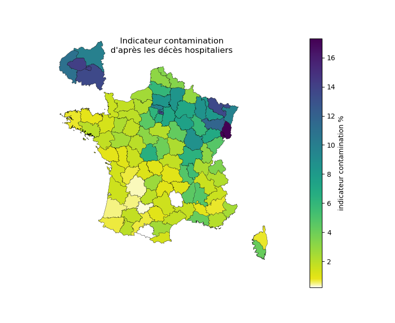

# COVID-19 Lire les anomalies

## Généralités

Prendre des décisions, comme partir en vacances ou fermer les parcs et jardins, nécessite de s'informer.
Les données sont des sources d'information inestimables mais encore faut-il savoir les interpréter, les critiquer, les challenger, les comprendre, y détecter des anomalies, les signaler et en rechercher la cause.
Toutes les anomalies ne sont pas des erreurs. Certaines peuvent être liées à des conditions particulières.
Sans information complémentaire sur la façon dont les données sont recueillies ou sur la réalité du terrain, il n'est pas toujours possible d'expliquer les anomalies. Dans certains cas on peut imaginer des hypothèses plus ou moins plausibles.

### Anomalie du week-end
Une anomalie classique des données COVID-19 disponibles sur data.gouv.fr est le défaut d'enregistrement le week-end.
Cette anomalie, visible sur le tracé ci-dessous, a été confirmée par le directeur général de la santé. Il faut donc attendre le mardi pour analyser la tendance.

### Anomalies départementales
Certaines anomalies ne concernent que quelques départements. Sommer les données de plusieurs départements permet d'atténuer ces anomalies. 

### Anomalies sur une donnée
Parfois l'anomalie ne concerne qu'un type de donnée comme les entrées en réanimation. La comparaison de plusieurs données, comme les hospitalisations et les décès avec les entrées en réanimation permet de détecter ce type d'anomalie.
On peut aussi comparer la donnée à la moyenne et à l'écart-type pour vérifier sa vraisemblance.

### Conclusion
Il est indispensable de regarder, analyser et croiser les données pour détecter les anomalies et rechercher à les expliquer avec de prendre des décisions. La donnée, comme toute information, doit être confirmée.

## Anomalies sur les entrées en réanimation croisées avec les décès

En général, le nombre d'entrées en réanimation et de décès sont similaires. 
Au 1er mai, la France comptait 15350 décès hospitaliers lié au COVID-19 et 15953 entrées en réanimation pour COVID-19.
Tout les écarts entre les décès et les entrées en réanimation signalent des anomalies.

**ATTENTION** : Les nombres des décès hospitaliers et des entrées en réanimation sont similaires et pourtant il y a moins de décès parmi les personnes en réanimation que les celles non en réanimation. D'ailleurs les personnes en réanimation sont nettement plus jeunes que les personnes décédées. Il ne faut pas confondre corrélation et lien de causalité. Le nombre de décès et le nombre de personnes en réanimation sont corrélés car ils sont causés par une cause commune la circulation du virus, mais il ne s'agit pas des mêmes personnes.

Voici la carte donnant par département le ratio entre décès et réanimation. 
Les départements en anomalie correspondent aux couleurs foncées.  

Ainsi le Tarn-et-Garonne déplore 4 décès au 1er mai et a eu 17 personnes entrées en réanimation dans la même période. Cette anomalie peut résulter du faible nombre d'évènements, ce qui rend l'information statistique moins significative ou avoir une autre cause.
A l'autre extrémité de l'échelle, les Vosges déplore 234 décès au 1er mai pour 123 personnes entrées en réanimation dans la même période. Cette anomalie peut résulter d'une des causes probables suivantes :
- une saturation des réanimations ;
- des décès apparus avant l'enregistrement des entrées en réanimation.

La Seine-Saint-Denis connait aussi une anomalie avec 835 décès pour 616 entrées en réanimation. La cause probable est la saturation des réanimations. Sachant que les patients peuvent être dirigés vers d'autres hopitaux de la région, cela n'implique pas un déficit de soin, mais montre la limite des chiffres départementaux lorsque les patients sont dispatchés à l'extérieur du département. Pour aller plus loin, il faut savoir comment les patients ont circulé entre les hopitaux d'Ile de France lorsque leur situation s'aggravait. 

## Anomalies sur les hospitalisations pour suspicion de COVID-19 après passage aux urgences

Sur la France, le nombre d'hospitalisations (pour suspicion de COVID-19 après passage aux urgences) est environ 3.5 fois le nombre des décès.
Au 1er mai, la France comptait 15350 décès hospitaliers lié au COVID-19 et 55034 hospitalisations.
La carte des ratios entre ces données par département montre une anomalie remarquable.

Il s'agit de la Haute-Corse.
La Haute-Corse a déploré 8 décès et aurait du avoir 30 hospitalisations, elle en a compté 1626. Les hospitalisations continuent encore au 30 avril à un rythme élevé.
Plusieurs explications sont possibles :
- les gens sont plus jeunes et donc guérissent mieux
- les personnes hospitalisées ne présentent pas des cas graves
- les personnes ont été hospitalisées pour être isolées, comme cela était préconisé au début de l'épidémie
- une erreur dans l'enregistrement des données
- une autre explication

Un communiqué du centre hospitalier de Bastia laisse entendre que des données d'une campagne proactive de tests ont été remontées dans les fichiers sans avoir été contrôlées sans toutefois tout expliquer.

Il n'est pas possible d'utiliser cette information sans avoir de plus amples explications de l'anomalie.

Le changement d'échelle de couleur montre d'autres anomalies.

Le Tarn-et-Garonne est en anomalie avec 202 hospitalisations pour 4 décès. Les hospitalisations se sont cependant arrêtées le 10 avril.

La Haute-Loire présente une anomalie inverse avec 5 personnes hospitalisées après passage aux urgences pour suspicion de COVID-19, 7 entrées en réanimation et 11 décès. 
Les patients circulent entre les hopitaux d'une même région et parfois entre les régions et il est difficile de juger un département seul. C'est une explication possible, mais probablement pas la bonne.

## Anomalies sur la contamination déduite des décès hospitaliers

On peut considérer que les décès hospitaliers sont un bon indicateur de la contamination de la zone.

Le Territoire de Belfort présente un nombre de décès important, 151, pour 140 000 habitants. Le département est petit et limitrophe du Haut-Rhin. Les malades sont répartis dans les hopitaux de la région en fonction des places et finalement le nombre de décès hospitaliers n'est pas le nombre de décès des habitants du département.

Il vaut mieux changer l'échelle de couleur pour gommer le biais du Territoire de Belfort. Une autre solution consisterait à sommer le Territoire de Belfort avec le Haut-Rhin.

L'indicateur de contamination vaut 8% pour le département de l'Oise, ce qui est proche de l'estimation de 10% présentée par l'Institut Pasteur dans le [communiqué de presse vidéo du 24/04/2020](https://youtu.be/WYlzJ5Mv3bk). Il est important de croiser les sources indépendantes.

## Conclusion
Il vaut mieux partager des données avec des anomalies et même des erreurs, les détecter, interroger les sources et les corriger pour prendre les bonnes décisions que de ne rien faire. 
