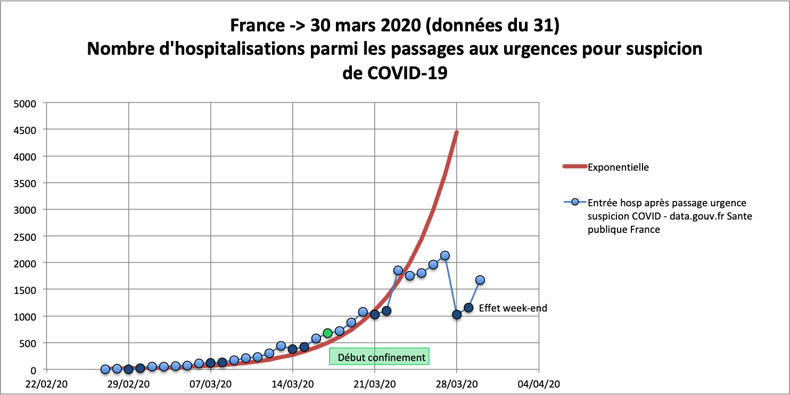

# covid-19-France

Données provenant de data.gouv.fr : https://www.data.gouv.fr/fr/datasets/donnees-des-urgences-hospitalieres-et-de-sos-medecins-relatives-a-lepidemie-de-covid-19/#discussion-5e81dd4a77c21352b6a2b6b5-1.
Ces données sont corrigées d'erreur évidentes, carré de la valeur au lieu de la valeur, valeurs de Nouvelle-Aquitaine égales à l'Ile de France...

Suivi des hospitalisations après passage aux urgences pour suspicion de COVID-19.

On note que jusqu'au 23 mars, les hospitalisations (après passage aux urgences pour suspicion de COVID-19) suivaient une courbe exponentielle et que l'on note un plateau depuis. 
On note aussi une diminution des hospitalisations le week-end et un rattrapage le lundi suivant.
Le plateau peut être du :
- à un fléchissement de l'épidémie en raison du confinement
- ou à un durcissement des critères d'hospitalisation

