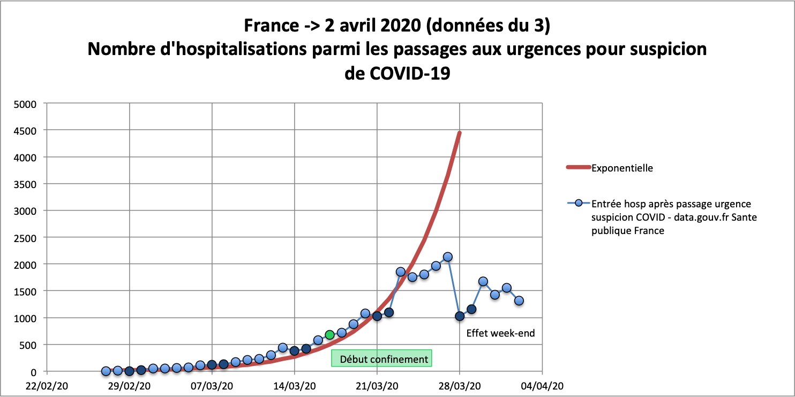
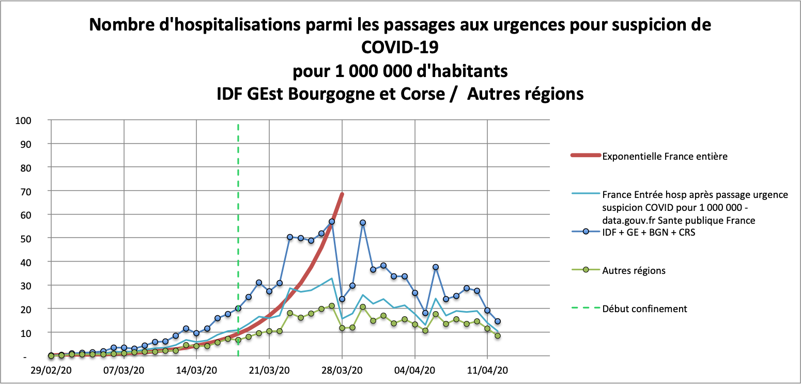

# covid-19-France

Données provenant de data.gouv.fr : https://www.data.gouv.fr/fr/datasets/donnees-des-urgences-hospitalieres-et-de-sos-medecins-relatives-a-lepidemie-de-covid-19/#discussion-5e81dd4a77c21352b6a2b6b5-1.
Ces données sont corrigées d'erreur évidentes, carré de la valeur au lieu de la valeur, valeurs de Nouvelle-Aquitaine égales à l'Ile de France...

Suivi des hospitalisations après passage aux urgences pour suspicion de COVID-19.

On note que les hospitalisations (après passage aux urgences pour suspicion de COVID-19) ont suivi une courbe exponentielle jusqu'au 23 mars avant d'atteindre un plateau. 
Les données montrent une diminution des hospitalisations le week-end suivie d'un rattrapage le lundi suivant.
Le plateau peut être du :
- à un fléchissement de l'épidémie en raison du confinement
- à un changement des procédures d'hospitalisation
- à une saturation du 15

Les données d'hospitalisations (après passage aux urgences pour suspicion de COVID-19) des régions les plus touchées, Ile de France, Grand Est, Bourgogne Franche Comté et Corse, présentent une évolution tout à fait similaire à celles des régions les moins touchées, avec une amplitude plus importante. Comme il n'y a pas de saturation du 15 dans les régions les moins touchées, cette hypothèse serait à écarter.

