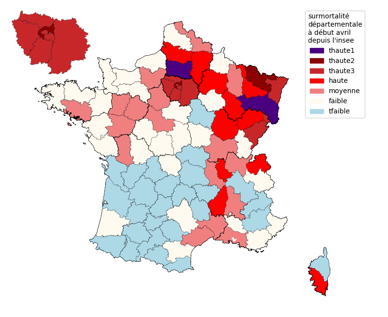

# covid-19-France

Données provenant de data.gouv.fr :
- [donnees des urgences hospitalières](https://www.data.gouv.fr/fr/datasets/donnees-des-urgences-hospitalieres-et-de-sos-medecins-relatives-a-lepidemie-de-covid-19/#discussion-5e81dd4a77c21352b6a2b6b5-1)

- [donnees hospitalières](https://www.data.gouv.fr/fr/datasets/donnees-hospitalieres-relatives-a-lepidemie-de-covid-19/)

Autres données :

- [donnees de surmortalité de l'insee](https://www.insee.fr/fr/information/4470857#graphique-figure2_radio1)

Ces données sont parfois corrigées d'erreur évidentes, carré de la valeur au lieu de la valeur...


# Modélisation de la mortalité en fonction des passages aux urgences et des entrées en réanimation.

## Les données départementales
Les données sont très bruitées, notamment en raison de défaut d'enregistrement le week-end et les jours fériés et du petit nombre de données dans les départements, même peuplés comme la Seine-Saint-Denis, comme le montre l'image suivante.


Cette image montre les courbes des décès hospitaliers quotidiens, des entrées en réanimation hospitalières et des hospitalisations après passage aux urgences issues des données postées par Santé Publique France sur data.gouv.fr.
Les sorties de rea sont déduites des données de rea et d'entrées en rea.

Le lissage des données de decès permet de mieux lire les tendances, mais la modélisation donne un bien meilleur résultat.
Les décès ont été modélisés à partir des données d'hospitalisations après passage aux urgences et des entrées en réanimation. Ces courbes de décès modélisés permettent de mieux comparer les départements entre eux. 

La courbe des décès modélisés ou prévus est tracée dans l'image ci-dessus en pointillés rouge foncé.

Finalement, les départements ont été groupés par type, en fonction de leur surmortalité calculée par l'insee et en distinguant, pour les départements les plus touchés, la date d'apparition de la haute surmortalité.


## Départements classés par surmortalité

Voici la classification des départements en fonction de leur surmortalité.
La première catégorie correspond au Bas-Rhin, aux Vosges et à l'Oise.
La deuxième catégorie regroupe la Moselle, les Hauts-de-Seine et la Seine-Saint-Denis.
Les données lors du début de la circulation dans le Bas-Rhin et l'Oise ne sont pas disponibles et ont été extrapolées.



## Indicateur - tendance des décès modélisés

Voici les courbes des décès modélisés pour chaque classe de départements. Les données sont normalisées pour 1 million d'habitants.


La méthode a un léger biais qui résulte du fait qu'en fonction de la circulation de l'épidémie, les conditions d'hospitalisations sont devenues plus strictes. 
A fin avril, la baisse de la circulation de l'épidémie est bien visible.

## Quelques chiffres de comparaison

Pour chaque groupe de départements, on a la population en million (M), les décès totaux.
On peut comparer le total des décès sur la période par million d'habitants avec les décès modélisés (dcmod) sur la même période, toujour par M.
On note que les chiffres sont très voisins. 
En adoptant une létalité de 0.5 % (soit 0.5% des personnes infectées décèdent), on en déduit le pourcentage des personnes qui ont été infectées dans ces départements. La létalité a été choisie pour coller aux chiffres fournis par l'Institut Pasteur dans la presse.
On peut en déduire en indicateur prévu au 9 mai pour mesurer la circulation résiduelle du virus. Une bonne valeur serait 30, ce qui correspond à la circulation actuelle dans les départements les moins touchés. 

La dernière ligne correspond à la valeur extrapolée des décès modélisés par jour et par million d'habitant.
```
                    thaute1 thaute2 thaute3 haute moyenne faible tfaible
population M          1.9     4.3    10.8   6.5    13.4   16.5    11.5
Total dc             1229    2286    4901  1644    1952   1469     606
Total dc par M        631     529     454   252     146     89      53
Total dcmod par M     728     501     446   247     150     96      63
max dcmod/j par M      26      20      19    11       6      4       3
letalité %            0.5     0.5     0.5   0.5     0.5    0.5     0.5
% infectés           12.9    10.6     9.1   5.1     2.9    1.8     1.1
indicateur 9/5        280     299     197    94      60    108      35
der dcmod/j par M     1.4     1.5       1   0.5     0.3    0.5     0.2
```

Plus d'info : https://github.com/htonchia/covid-19-France/blob/master/Comparaison.md et notamment les tracés par groupe de départements.
