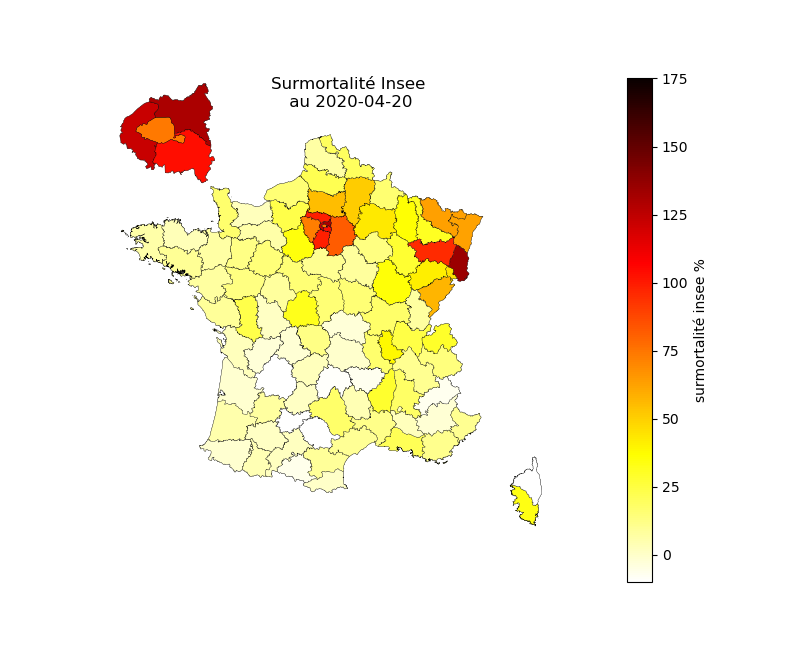
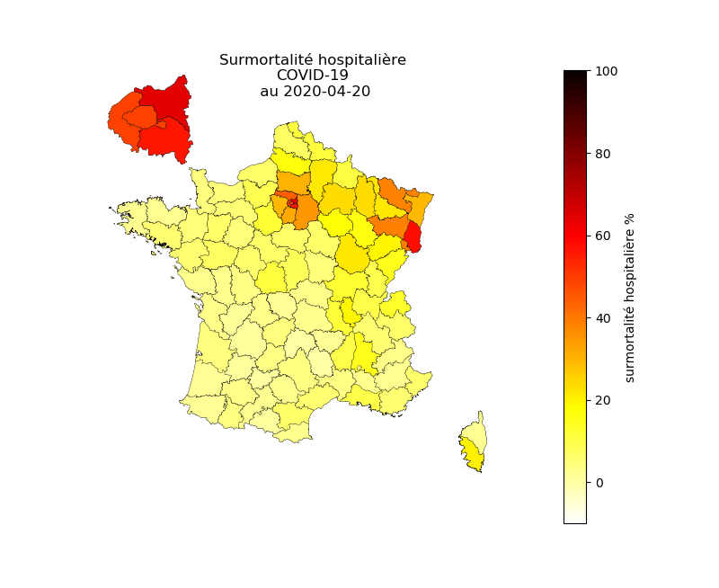
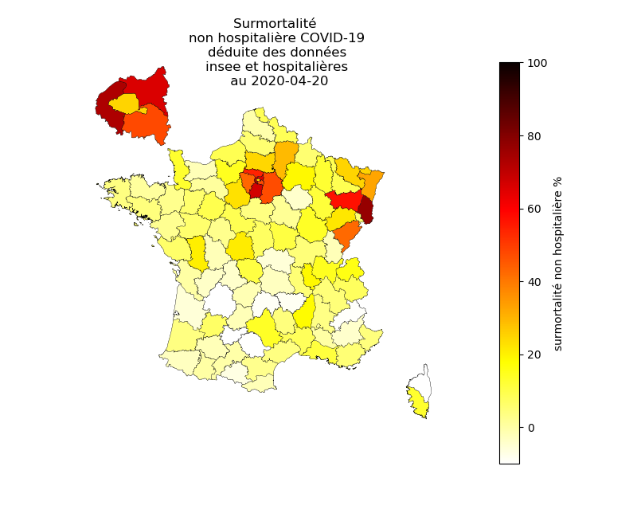

# Surmortalités hospitalière COVID-19 et non hospitalière depuis le 1er mars 2020 par rapport à 2019

## Les données

Données provenant de data.gouv.fr :

- [donnees hospitalières](https://www.data.gouv.fr/fr/datasets/donnees-hospitalieres-relatives-a-lepidemie-de-covid-19/)

Données provenant de l'insee :

- [donnees de surmortalité de l'insee](https://www.insee.fr/fr/information/4470857)

- [données statistiques de population](https://www.insee.fr/fr/statistiques/1893198)

Les données cartographiques (limites des départements) proviennent de l'IGN.

## La surmortalité par rapport à 2019

La surmortalité représente la hausse de la mortalité entre 2020 et la même période de 2019.
Les données de l'Insee concernent la période débutant au 01 mars et se terminant quelques semaines avant la date courante. Au 4 mai, les données de l'Insee étaient renseignées jusqu'au 20 avril.

Avec le confinement, la surmortalité est négative dans les départements non touchés par le COVID-19.

La surmortalité rend compte de trois phénomènes :

- les décès hospitaliers dus au COVID-19 qui sont un accroissement par rapport à 2019 ;

- le déficit des décès liés au confinement qui dépasse parfois 10% dans les départements peu touchés par le COVID-19 ;

- les décès non hospitaliers dus au COVID-19 qui sont un accroissement par rapport à 2019.

Les décès hospitaliers dus au COVID-19 sont fournis dans les jeux de données de data.gouv.fr. Les autres peuvent être estimés à partir des données de l'insee. Leur somme est la différence entre la hausse de la surmortalité déduite des données de l'insee et les décès hospitaliers.

## Surmortalité totale par département

## Surmortalité hospitalière due au COVID19 par département

## Surmortalité non hospitalière

La surmortalité non hospitalières comprend notamment les décès en ehpad non actuellement disponibles par département.

## Observations

**Dans certains départements comme les Hauts-de-Seine et le Haut-Rhin, la surmortalité non hospitalière est plus importante que la surmortalité hospitalière liée au COVID-19.**

**Les départements de la petite couronne connaissent une forte surmortalité non hospitalière mais pas Paris**.

**La France connait une surmortalité de plus de 3000 décès non actuellement attribués au COVID-19.**

Sur la totalité de la France, la surmortalité non hospitalière COVID-19 est d'environ 11 000 décès au 20/04/2020, alors qu'à la même date les décès attribués au COVID-19 dans les ehpad et ems sont d'environ 7700, soit un excès d'environ **3300** (soit 40% des décès attribués au COVID-19 en ehapd et ems). Ces décès sont plus probablement liés au COVID-19 qu'à une autre cause. Ils peuvent avoir eu lieu en ephad, à domicile ou même à l'hôpital sans être attribué au COVID-19.
Comme les décès autres ont diminué en raison du confinement, ce nombre de 3300 sous-estime probablement les décès liés au COVID-19 non comptabilisés. 
Le déficit de mortalité lié au confinement dans les départements les moins touchés atteint 10 %. Avec un déficit de mortalité estimé à 10 % sur la totalité du territoire, la surmortalité lié au COVID-19 serait alors de 11 700 décès, ce qui parait être une fourchette haute.
