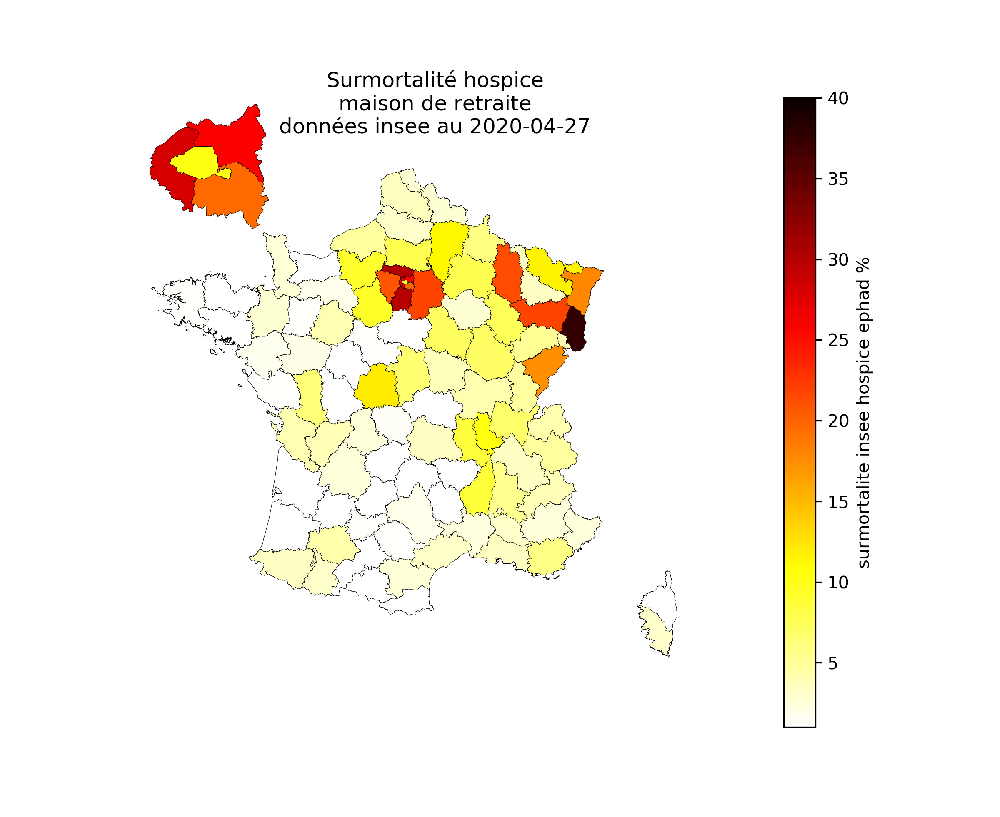

# Surmortalités hospitalière COVID-19 et non hospitalière depuis le 1er mars 2020 par rapport à 2019

## Présentation

La comparaison des différentes sources de données disponibles indique une large hausse des décès, au 20 avril 2020, non expliquée par les chiffres officiels des décès lié au COVID-19. Les cartes ont été mises à jour des données du 7 mai mises à jour au 27 avril 2020.

Une analyse détaillée des données des **Hauts-de-Seine** indique que la surmortalité autre que COVID-19 à l'hôpital et EHPAD, donc **non comptabilisée, atteint 60 % de la surmortalité COVID-19 à l'hôpital et EHPAD**.

### Les données

Données provenant de data.gouv.fr :

- [donnees hospitalières](https://www.data.gouv.fr/fr/datasets/donnees-hospitalieres-relatives-a-lepidemie-de-covid-19/)

Données provenant de l'insee :

- [donnees de surmortalité de l'insee](https://www.insee.fr/fr/information/4470857)

- [données statistiques de population](https://www.insee.fr/fr/statistiques/1893198)

Les données cartographiques (limites des départements) proviennent de l'IGN.

### La surmortalité par rapport à 2019

La surmortalité représente la hausse de la mortalité entre 2020 et la même période de 2019.
Les données de l'Insee concernent la période débutant au 01 mars et se terminant quelques semaines avant la date courante. Au 4 mai, les données de l'Insee étaient renseignées jusqu'au 20 avril.

Avec le confinement, la surmortalité est négative dans les départements non touchés par le COVID-19.

La surmortalité rend compte de trois phénomènes :

- les décès hospitaliers dus au COVID-19 qui sont un accroissement par rapport à 2019 ;

- le déficit des décès liés au confinement qui dépasse parfois 10% dans les départements peu touchés par le COVID-19 ;

- les décès non hospitaliers dus au COVID-19 qui sont un accroissement par rapport à 2019.

Les décès hospitaliers dus au COVID-19 sont fournis dans les jeux de données de data.gouv.fr. Les autres peuvent être estimés à partir des données de l'insee. Leur somme est la différence entre la hausse de la surmortalité déduite des données de l'insee et les décès hospitaliers.

## Cartographie

Les données hospitalières comme les données administratives enregistrent les décès au lieu du décès et pas au lieu de résidence.
La surmortalité est donnée en pourcentage de la mortalité de 2019.
Une surmortalité de 200 % indique que l'accroissement du nombre de décès en 2020 est le double du nombre de décès en 2019 et donc que le nombre total de décès de 2020 est le triple du nombre total de décès de 2019.
Une surmortalité négative indique une diminution du nombre de décès en 2020 par rapport à 2019.

### Surmortalité totale par département

### Surmortalité hospitalière due au COVID19 par département

### Surmortalité non hospitalière

La surmortalité non hospitalière comprend notamment les décès en ehpad non actuellement disponibles par département.

### Observations

**Dans certains départements comme les Hauts-de-Seine et le Haut-Rhin, la surmortalité non hospitalière est plus importante que la surmortalité hospitalière liée au COVID-19.**

**Les départements de la petite couronne connaissent une forte surmortalité non hospitalière mais pas Paris**.

**La France connait une surmortalité de plus de 3000 décès non actuellement attribués au COVID-19.**

Sur la totalité de la France, la surmortalité non hospitalière COVID-19 est d'environ 11 000 décès au 20/04/2020, alors qu'à la même date les décès attribués au COVID-19 dans les ehpad et ems sont d'environ 7700, soit un excès d'environ **3300** (soit 40% des décès attribués au COVID-19 en ehapd et ems). Ces décès sont plus probablement liés au COVID-19 qu'à une autre cause. Ils peuvent avoir eu lieu en ephad, à domicile ou même à l'hôpital sans être attribué au COVID-19.
Comme les décès autres ont diminué en raison du confinement, ce nombre de 3300 sous-estime probablement les décès liés au COVID-19 non comptabilisés. 
Le déficit de mortalité lié au confinement dans les départements les moins touchés atteint 10 %. Avec un déficit de mortalité estimé à 10 % sur la totalité du territoire, la surmortalité lié au COVID-19 serait alors de 11 700 décès, ce qui parait être une fourchette haute.

## Analyse des données des Hauts-de-Seine

L'Insee fournit des données plus détaillés qui précisent le lieu du décès selon quatre catégories :

- hôpital

- hospice, maison de retraite ou EHPAD

- logement

- voie publique ou autre

- non renseigné.

La rubrique autre couvre notamment les décès dans la famille, au travail, chez des amis...

### Les chiffres généraux des Hauts-de-Seine au 20 avril 2020

Décès depuis le 1er mars.

Décès 2019 : 1410

Décès 2020 : 3136

Surmortalité : 1726, soit une hausse de 122 %

Décès hospitaliers COVID-19 : 695

Les 695 décès hospitaliers sont loin d'expliquer la hausse de 1726 décès observée sur la période.

### Les chiffres détaillés des Hauts-de-Seine au 20 avril 2020

|       |   Autres |   HopCli |   HosMar |   Logem |   Non renseigne |
|:------|---------:|---------:|---------:|--------:|----------------:|
| 2019  |       25 |      915 |      121 |     312 |              37 |
| 2020  |       30 |     1582 |      538 |     824 |             162 |
| delta |        5 |      667 |      417 |     512 |             125 |

Avec 695 décès hospitaliers du au COVID-19 et une surmortalité hospitalière de 667, il apparaît une baisse des décès hospitaliers autre que COVID-19, qui pourrait résulter du report de certaines opérations, de la tension des urgences pendant quelques jours ou du fait que les personnes hésitent à aller à l'hôpital.

Malgré une baisse officielle en France des accidents de la route, les décès autres ont légèrement augmenté.

Les décès en hospices, maisons de retraite et EHPAD dont explosé à presque 4 fois plus. 

Finalement, entre les décès survenus au logement, ceux non renseignés et les autres, le département des Hauts-de-Seine présente une surmotalité de 642 personnes non attribuée au COVID-19, qui est pourtant du même ordre de grandeur que les décès hospitaliers lié au COVID-19.

Dans le tableau ci-dessous, on admet que la surmortalité en EHPAD a bien été attribuée au COVID-19, même si les informations disponibles ne permettent pas de l'affirmer. Par contre la surmortalité non expliquée est bien là.

| Surmortalite | hop COVID-19 | EHPAD COVID_19 | Non expliquée |
|:-------------|-------------:|---------------:|--------------:|
|   2020/2019  |          695 |            417 |           642 | 

**40 % de la surmortalité des Hauts-de-Seine au 20 avril 2020, soit environ 640 décès, n'est a priori pas attribuée au COVID-19 et serait absente des chiffres officiels.**

## Cartographie détaillée des données de surmortalité de l'Insee

L'Insee fournit des données plus détaillés qui précisent le lieu du décès selon quatre catégories :

- hôpital

- hospice, maison de retraite ou EHPAD

- logement

- voie publique ou autre

- non renseigné.

La rubrique autre couvre notamment les décès dans la famille, au travail, chez des amis...

Les cartes suivantes donnent la surmortalité exprimée en pourcentage de la mortalité 2019 pour les catégories de l'Insee.
Les décès hospitaliers de Santé Publique France sont retirés des données de décès à l'hôpital de l'Insee pour visualiser la différence.

Il s'agit du département du lieu du décès, pas du département de résidence.

### Décès hospitaliers Insee moins les décès hospitaliers Santé Publique France

### Décès Insee en hospice, maison de retraite ou EHPAD

### Décès Insee au logement

Les Hauts-de-Seine et Paris présentent une anomalie très forte qui mériterait d'être analysée. Est-ce dû à la saturation des hopitaux dans ces deux départements ? Pourquoi les autres départements de la couronne, comme la Seine-saint-Denis et le Val-de-Marne n'ont pas une telle anomalie ?

### Décès Insee sur la voie publique ou autre

### Décès Insee non renseigné

