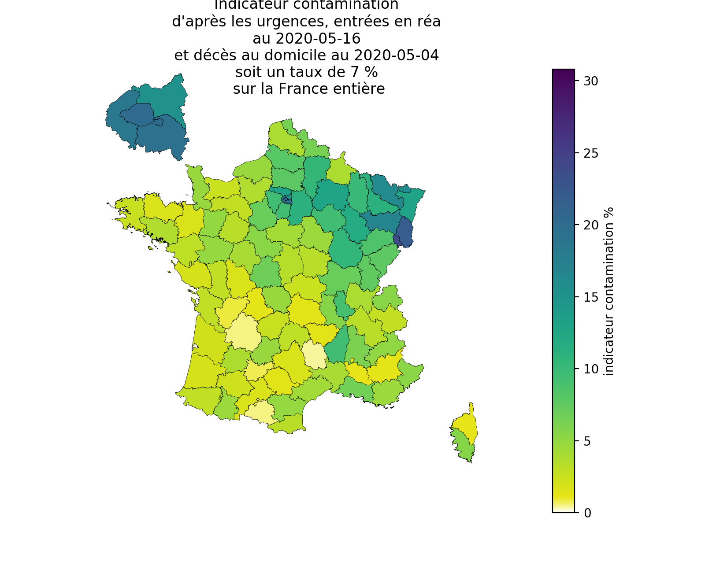
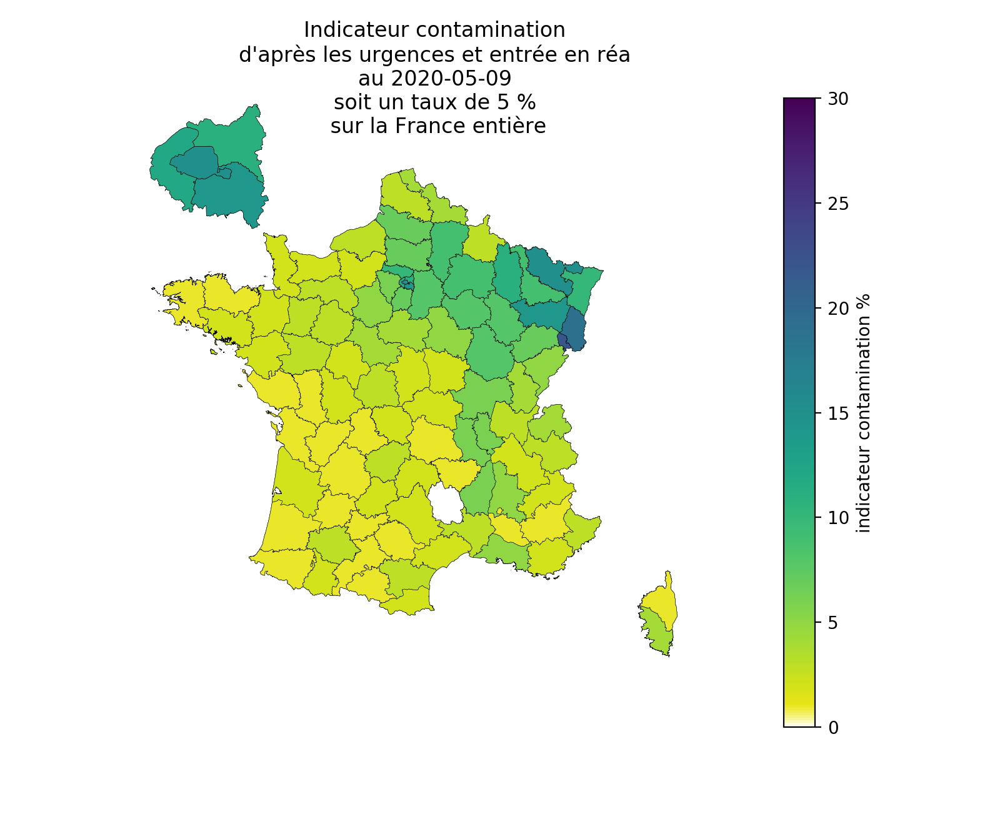
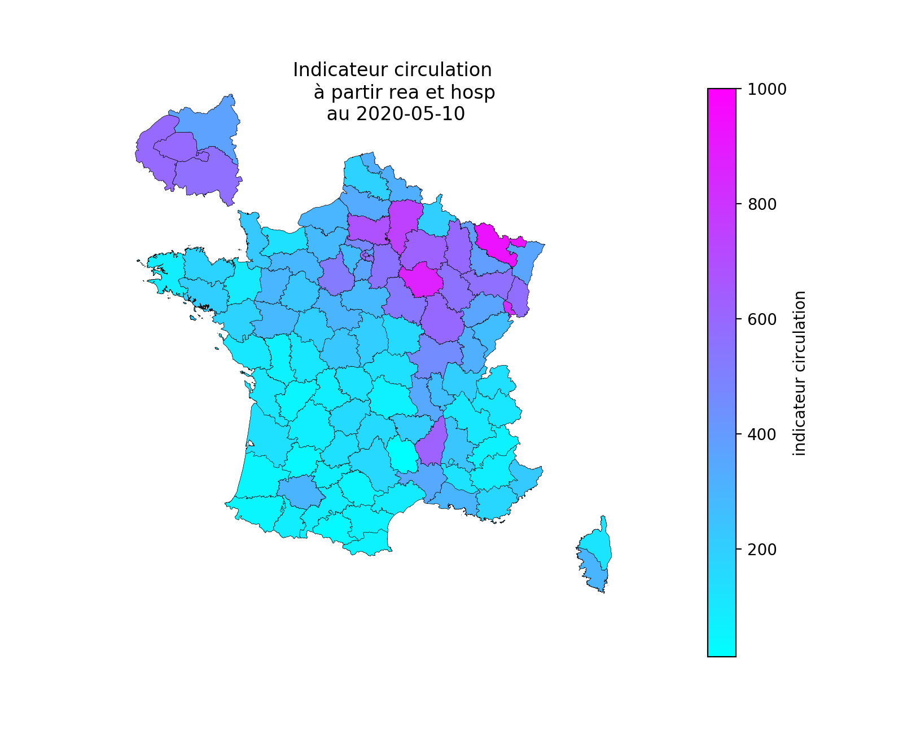

# Contamination

## L'épidémie est comme un feu

Pour se propager l'épidémie est comme un feu. Elle démarre lorsque des braises enflamment la paille qui allume le bois.

Les braises sont les personnes qui portent le virus, la paille les personnes à risque et le bois les personnes qui vont transporter le virus sous forme d'une braise qui va s'éteindre comme mouillée. Les personnes guéries seraient comme du bois mouillés qui a du mal à prendre feu. 

L'immunité collective fonctionne lorsque les personnes guéries n'attrapent pas la maladie une seconde fois et qu'elles sont suffisament nombreuses pour empêcher à l'épidémie de se propager.

La contamination mesure le pourcentage de bois mouillé dans la population et la circulation le nombre de braise.
La paille, donc les personnes à risques, sont présentent partout. 

A nombre de braise égal, un feu a plus de chance de se propager là où le bois est sec que là où il y a beaucoup de bois mouillé. 
Au 9 mai, les données des urgences montrent qu'il y a plus de braise dans les départements les plus contaminés. Les récents clusters de Nouvelle Aquitaine en [Dordogne et dans la Vienne](https://www.ouest-france.fr/sante/virus/coronavirus/coronavirus-deux-foyers-en-nouvelle-aquitaine-dans-la-vienne-et-en-dordogne-6830188) montrent que le virus circule cependant partout et est prêt à enflammer les zones jusqu'ici épargnées. Il est donc important que la paille, c'est à dire les personnes à risque, reste la plus isolée possible pour ne pas s'enflammer sur les braises qui continuent de circuler. 
 

## Présentation

On peut estimer le taux de contamination à partir des décès car le nombre de décès est proportionel au nombre de personnes contaminées. 
Si on estime que la létalité est de 0.5 % c'est à dire que pour 1000 personnes infectées 5 décèdent, si on déplore 5 décès alors on en déduit que 1000 personnes ont été contaminées.

Mais alors comment compter les décès ?

Les personnes dans les EHPAD ne circulent pas, elles ne sont donc pas représentatives de la circulation du virus. Les décès hospitaliers sont plus représentatifs.
Par contre, comme le montre [l'analyse de la surmortalité des Hauts-de-Seine](cartes_deces_hosp_nonhosp.md#analyse-des-données-des-hauts-de-seine), la surmortalité au logement est loin d'être négligeable et dans ce cas est du même ordre de grandeur que la surmortalité hospitalière dû au COVID-19.

Les deux cartes suivantes présentent la contamination calculée, non pas à partir des décès mais à partir des entrées en réanimation et des hospitalisations après passage aux urgences pour suspiction de COVID-19, complétée de la surmortalité au logement pour la seconde. 

La létalité a été prise à 0,5%. 

L'indicateur de contamination de l'Oise au 09 mai 2020 vaut 7% dans les deux cas, cette valeur est proche de l'estimation de 10% présentée par l'Institut Pasteur dans le communiqué de [presse vidéo du 24/04/2020](https://youtu.be/WYlzJ5Mv3bk).
La valeur sur la France entière, sans les décès au domicile, est de 5%, elle monte à 7%, en prenant en compte les décès au domicile.
Cependant, cette hausse est plus importante sur certains départements en tension. Ainsi le taux des Hauts-de-Seine passe de 12% à 18% et celui de Paris passe de 15% à 20%.
En raison du confinement la majorité des personnes contaminées ne devraient plus être contagieuses. 

Une version "interactive" des cartes affichent le nom du département et la valeur de la contamination au survol de la souris. Elles sont disponibles par les liens fournis.

## Estimation de la contamination d'après les données hospitalières complétées des données de la surmortalité au logement.

La surmortalité au logement est calculée d'après les données de l'Insee disponibles avec plus de deux semaines de délai. La surmortalité au logement est donc probablement supérieure dans les départements où elle est significative.

Seule la surmortalité positive a été prise en compte.

[lien carte interactive au survol de la souris pour les navigateurs compatibles](https://raw.githubusercontent.com/htonchia/covid-19-France/master/Images/ca_carte_contamination_mod_logem.png)

## Estimation de la contamination d'après les données hospitalières seules

[lien carte interactive au survol de la souris pour les navigateurs compatibles](https://raw.githubusercontent.com/htonchia/covid-19-France/master/Images/ca_carte_contamination_mod.svg) 

## Estimation de la circulation d'après les données hospitalières seules

La circulation correspond à la vitesse à laquelle augmente la contamination. Les données de surmortalité au logement, avec leur quinze jours de retard sont trop anciennes pour estimer la circulation.

# Conclusion

Même si la France est encore loin de l'immunité collective, c'est à dire du taux de contamination auquel l'épidémie s'arrête d'elle même,  on doit prendre en compte les décès au logement pour évaluer la circulation du virus et le taux de contamination des différents territoires. 

Au 9 mai, l'Île de France, très touchée, présente une forte contamination et la circulation, encore très active, semble enfin marquer le pas, plus que dans d'autres départements.  

