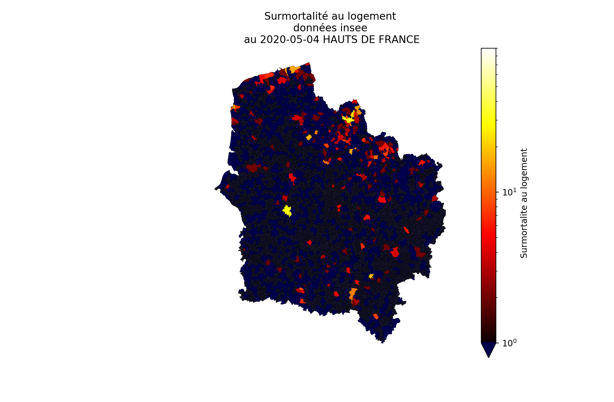
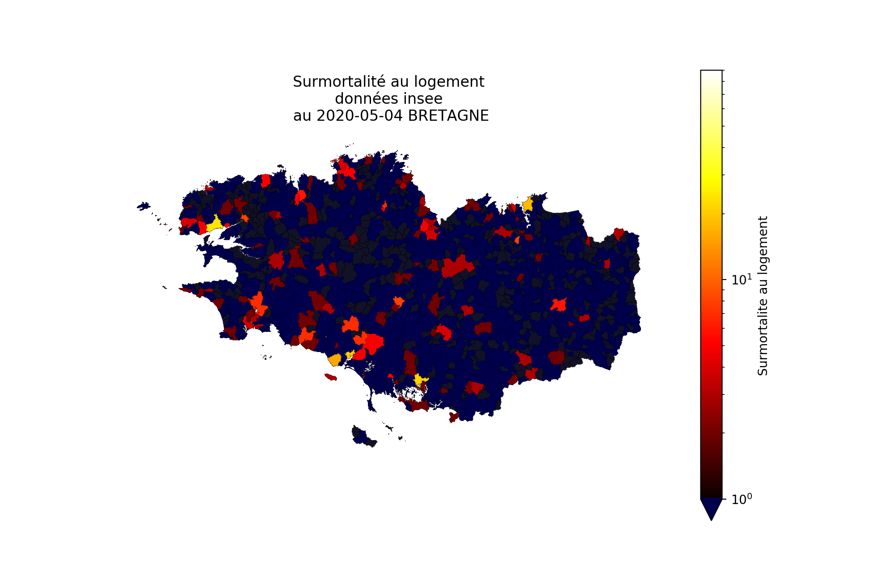
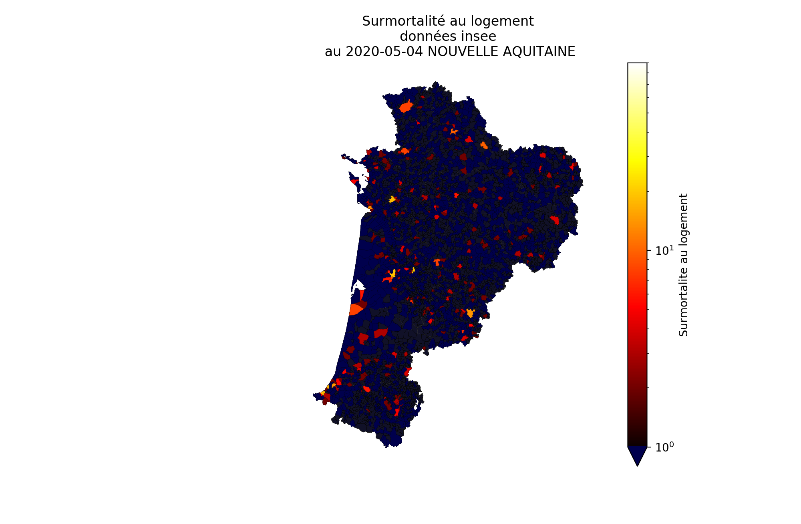
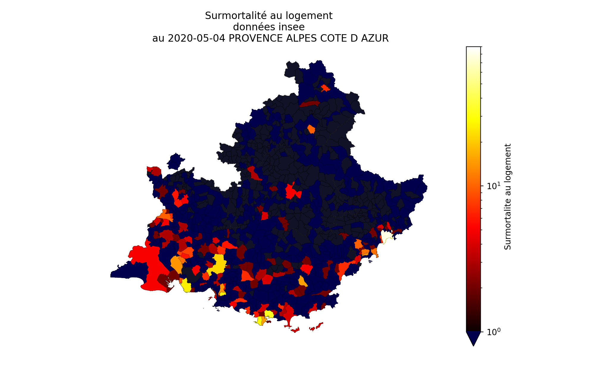
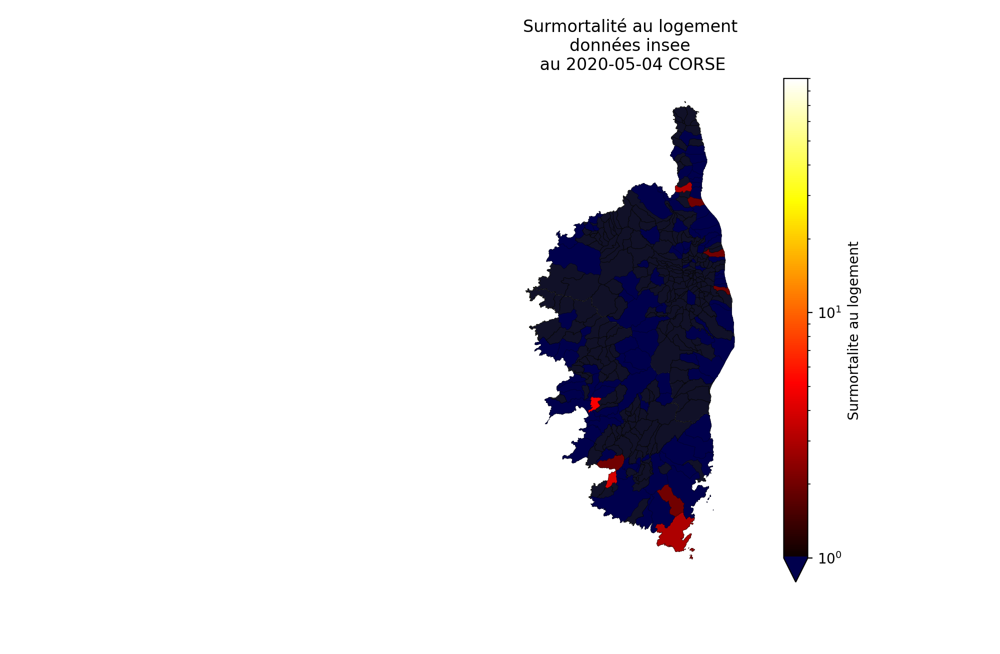

# Surmortalité détaillée par lieu du décès et commune

L'origine des données, le détail des lieu de décès et la surmortalité, ainsi que les cartes départementales sont présentées [ici](cartes_deces_hosp_nonhosp.md).

L'analyse cartographique par commune est présentées ci-dessous.
Les données proviennent de l'Insee et ont une quinzaine de jours de retard vis à vis des données hospitalières. Elles permettent cependant de voir des informations absentes des données de Santé Publique France et notamment la localisation de la surmortalité en EHPAD et localisation et le nombre de la surmortalité au logement. 

## La surmortalité au logement

Entre 2019 et 2020 sur la période au 1er mars au 20 avril la surmortalité au logement présente les caractéristiques suivantes :
|                        |  2020 - 2029 |
|:-----------------------|-------------:|
| Surmortalité positive  |        12195 |      
| Surmortalité negative  |        -6301 |    
| Surmortalité totale    |         5894 |

Au même moment, la mortalité hospitalière et en EHPAD de Santé publique France s'élève à 20 265. La surmortalité au logement est loin d'être négligeable. Une partie peut être liée à des défauts d'hopitalisation de patients dans des zones en tension et une autre peut être liée à des décès dus au COVID-19 ayant eu lieu au domicile.

Certaines zones présentent une surmortalité positive et d'autres une surmortalité négative.

La carte de la surmortalité départementale est disponible [ici](cartes_deces_hosp_nonhosp.md#décès-insee-au-logement).

Un tracé au niveau de la commune permet de mieux visualiser la différence entre les Hauts-de-Seine et la Seine-Saint-Denis et de tordre le cou aux idées préconçues sur le lien avec la richesse du département. Le bleu représente les communes dont la mortalité au logement a baissé en 2020 par rapport à 2019. 

#### _ 
Les zooms régionaux permettent de mieux voir les communes qui présentent une surmortalité.

- [Ile de France](#ile-de-france)
- [Centre Val de Loire](#Centre-Val-de-Loire)
- [Bourgogne Franche-Comté](#Bourgogne-Franche-Comté)
- [Normandie](#Normandie)
- [Hauts de France](#Hauts-de-France)
- [Grand Est](#Grand-Est)
- [Pays de la Loire](#Pays-de-la-Loire)
- [Bretagne](#Bretagne)
- [Nouvelle Aquitaine](#Nouvelle-Aquitaine)
- [Occitanie](#Occitanie)
- [Auvergne Rhone Alpes](#Auvergne-Rhone-Alpes)
- [Provence Alpes Côte d'Azur](#Provence-Alpes-Côte-dAzur)
- [Corse](#Corse)

### Zooms régionaux surmortalité au logement
#### Ile de France

[retour](#_)
#### Centre Val de Loire

[retour](#_)
#### Bourgogne Franche-Comté

[retour](#_)
#### Normandie

[retour](#_)
#### Hauts de France

[retour](#_)
#### Grand Est

[retour](#_)
#### Pays de la Loire

[retour](#_)
#### Bretagne

[retour](#_)
#### Nouvelle Aquitaine

[retour](#_)
#### Occitanie

[retour](#_)
#### Auvergne Rhone Alpes

[retour](#_)
#### Provence Alpes Côte d'Azur

[retour](#_)
#### Corse

[retour](#_)

